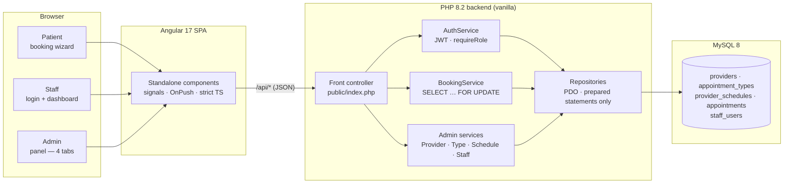

# Clinic Appointment Booking System

> Vanilla PHP 8.2 · MySQL 8 · Angular 17 · Deployed on Railway · MIT License

A production-ready clinic appointment booking system. Patients book appointments online; staff manage schedules through a dashboard; admins configure the entire clinic — providers, appointment types, schedules, and staff accounts — through a built-in admin panel. No SQL required after the initial setup.

[](https://clinic-booking-production.up.railway.app)
[](https://www.php.net/)
[](https://angular.io/)
[]()
[](LICENSE)

---

## 🚀 Live Demo

**[https://clinic-booking-production.up.railway.app](https://clinic-booking-production.up.railway.app)**

| Role | Username | Password | Note |
|------|----------|----------|------|
| Patient | *(no login needed)* | — | Just open the link |
| Admin | `admin` | `admin123` | First login forces a password change |
| Receptionist | `reception` | `reception123` | Staff dashboard |
| Doctor | `ana.reyes` | `doctor123` | Doctor view (own schedule only) |
| Doctor | `luis.mendoza` | `doctor123` | Doctor view |

> Staff login is at the bottom of the booking page.

---

## Architecture at a glance



The double-booking guard lives in `BookingService::create()` — a `SELECT … FOR UPDATE` inside an explicit transaction locks the candidate slot so concurrent writes can't both succeed. Status transitions (`pending → confirmed → completed`, etc.) are enforced by an explicit allow-list in `BookingService::transition()`. PII is never logged; `end_time` is always derived server-side from `appointment_types.duration_minutes`.

---

## Features

| Feature | Status |
|---|---|
| Patient booking wizard (5-step) | ✅ |
| Double-booking prevention (`SELECT … FOR UPDATE`) | ✅ |
| Real-time slot availability | ✅ |
| Booking confirmation page | ✅ |
| Staff login (JWT, 12 h TTL) | ✅ |
| Staff schedule dashboard | ✅ |
| Confirm / Complete / Cancel from dashboard | ✅ |
| **Admin panel — manage providers, types, schedules, staff** | ✅ |
| **Forced first-login password change** | ✅ |
| Email confirmations (PHPMailer, SMTP) | ✅ |
| Mobile-responsive CSS | ✅ |
| 101 PHPUnit tests | ✅ |

---

## Project layout

```
backend/
  db/
    migrations/       001–006 SQL migrations (run automatically)
    schema.sql        Table definitions
    seed_demo.sql     Demo data (2 doctors, 3 types, 4 staff)
    setup_clinic.sql  Deprecated SQL template (see admin panel instead)
  src/
    Database/         PDO singleton
    Exception/        ValidationException, ConflictException, AuthorizationException, …
    Http/             Router, Request, Response
    Repository/       Appointment, Provider, AppointmentType, Schedule, Staff repos
    Service/          AuthService (JWT), BookingService, AvailabilityService,
                      ProviderManagementService, AppointmentTypeService,
                      ScheduleManagementService, StaffManagementService
    Util/             Slug (accent-folded slug generation)
  public/index.php    Front controller (all routes)
  tests/              101 PHPUnit unit tests
  scripts/migrate.php Migration runner (tables + optional demo data)

frontend/
  src/app/
    booking/          5-step patient booking wizard
    confirmation/     Booking confirmation
    staff-login/      Staff authentication form
    staff-dashboard/  Schedule table with action buttons
    admin-panel/      Admin shell + Providers / Types / Schedules / Staff tabs
    change-password/  First-login forced password change
    services/         ApiService, AuthService, AdminApiService
    models/           TypeScript interfaces

CLAUDE.md             Architecture rules — read before modifying
```

---

## Prerequisites

- **PHP 8.2+** with extensions: `pdo_mysql`, `mbstring`, `openssl`
- **Composer 2**
- **MySQL 8.0+**
- **Node 20+ / npm**

---

## Quick start (4 steps)

### 1 — Clone and install

```bash
git clone https://github.com/HaronZ/clinic-booking.git
cd clinic-booking

cd backend && composer install && cd ..
cd frontend && npm install && cd ..
```

### 2 — Configure environment

```bash
cd backend
cp .env.example .env
```

Edit `.env` with your MySQL credentials and a strong JWT secret:

```ini
DB_HOST=127.0.0.1
DB_PORT=3306
DB_NAME=clinic_booking
DB_USER=root
DB_PASS=yourpassword
JWT_SECRET=change-this-to-a-64-char-random-string
```

### 3 — Create database and load data

```bash
mysql -u root -p -e "CREATE DATABASE IF NOT EXISTS clinic_booking CHARACTER SET utf8mb4 COLLATE utf8mb4_unicode_ci;"

# For exploring / development (loads demo providers, types, and staff):
php backend/scripts/migrate.php --demo

# For a real clinic (empty database — configure via admin panel):
php backend/scripts/migrate.php
```

### 4 — Start the servers

Open **two terminals**:

```bash
# Terminal 1 — PHP API (port 8080)
php -S localhost:8080 -t backend/public

# Terminal 2 — Angular dev server (port 4200)
cd frontend && npm start
```

Open **http://localhost:4200**

---

## Setting up a real clinic (admin panel)

If you ran `migrate.php` without `--demo`, log in as the initial admin to configure everything via the UI — no SQL editing required:

1. Click **"Staff login"** at the bottom of the booking page.
2. Log in as `admin` / `admin123`.
3. You'll be redirected to **Set Your Password** (forced first-login change).
4. After setting your password, you land on the **Admin Panel**.
5. Use the four tabs to configure:
   - **Providers** — add your doctors with names and specialties
   - **Appointment Types** — define visit types and durations (1–480 min)
   - **Schedules** — set each doctor's weekly working hours (7-day grid)
   - **Staff Accounts** — create receptionist and doctor login accounts

> The default `admin/admin123` credentials are intentionally blocked from production use by the forced password-change requirement.

---

## Default demo accounts

| Username | Password | Role |
|---|---|---|
| `admin` | `admin123` | Admin (first login forces password change) |
| `reception` | `reception123` | Receptionist |
| `ana.reyes` | `doctor123` | Doctor (linked to Dr. Ana Reyes) |
| `luis.mendoza` | `doctor123` | Doctor (linked to Dr. Luis Mendoza) |

---

## Running tests

```bash
cd backend
php vendor/phpunit/phpunit/phpunit --testdox
```

Expected: **101 tests, 201+ assertions** — all green.

---

## Email configuration

By default `MAIL_ENABLED=0` — emails are skipped. To enable:

```ini
MAIL_ENABLED=1
MAIL_HOST=smtp.gmail.com
MAIL_PORT=587
MAIL_USER=your-account@gmail.com
MAIL_PASS=your-16-char-app-password
MAIL_FROM=noreply@yourclinic.com
MAIL_FROM_NAME="Your Clinic"
```

---

## Troubleshooting

**`ERROR: Could not connect — SQLSTATE[HY000] [2002]`**
MySQL isn't running, or the credentials in `backend/.env` don't match. Verify:
- `mysql --version` returns a number (i.e. MySQL is installed)
- The MySQL service is running (`Get-Service MySQL*` on Windows, `brew services list` on Mac, `systemctl status mysql` on Linux)
- `DB_USER` and `DB_PASS` in `backend/.env` actually log in: `mysql -u <DB_USER> -p`

**`ERROR: JWT_SECRET is missing, still set to a placeholder, or shorter than 32 chars.`**
You copied `.env.example` to `.env` but didn't replace the `JWT_SECRET` line. Generate a real one:
```powershell
php -r "echo bin2hex(random_bytes(32)), PHP_EOL;"
```
Paste the output as the value of `JWT_SECRET=` in `backend/.env`, then re-run migrate.

**Booking page loads but `/api/*` requests return 404 / CORS errors**
The Angular dev server (`localhost:4200`) proxies `/api/*` to the PHP server (`localhost:8080`). If PHP isn't running on 8080, every request 404s. Open a second terminal and run:
```powershell
php -S localhost:8080 -t backend/public
```

**Admin panel is empty after first login**
You ran `php backend/scripts/migrate.php` without `--demo`, so the database has no providers, types, schedules, or non-admin staff yet. Either:
- Re-run with `--demo` (wipes data → fresh demo clinic), or
- Stay logged in as `admin` and configure providers / types / schedules / staff via the four admin tabs (the panel is designed for exactly this).

**`Column not found: 'must_change_password'` after deploying to Railway**
Migration 006 didn't apply. Trigger a redeploy after pulling the latest `master` (the migration runner now strips leading `--` comments correctly). Or run the migration manually:
```sql
ALTER TABLE staff_users
  ADD COLUMN must_change_password TINYINT(1) NOT NULL DEFAULT 0
  AFTER is_active;
```

**Tests fail with `Refusing to run tests against database '…'`**
`tests/bootstrap.php` requires the test DB name to contain the literal string `test`. Check `TEST_DB_NAME` in `backend/.env` — default is `clinic_booking_test`.

---

## API reference

### Public endpoints (no auth)

| Method | Path | Description |
|---|---|---|
| `GET` | `/api/providers` | List active providers |
| `GET` | `/api/appointment-types` | List active types |
| `GET` | `/api/availability` | Available slots for a date |
| `POST` | `/api/bookings` | Create booking |
| `GET` | `/api/bookings/{id}` | Get booking (no PII) |

### Staff endpoints (JWT)

| Method | Path | Description |
|---|---|---|
| `POST` | `/api/auth/login` | Login, returns JWT + staff info |
| `POST` | `/api/auth/change-password` | Change password, returns fresh JWT |
| `GET` | `/api/staff/schedule` | Today's appointments |
| `PATCH` | `/api/bookings/{id}/status` | Update booking status |

### Admin endpoints (JWT, admin role)

| Method | Path | Description |
|---|---|---|
| `GET/POST` | `/api/admin/providers` | List / create providers |
| `PATCH/DELETE` | `/api/admin/providers/{id}` | Update / soft-delete |
| `POST` | `/api/admin/providers/{id}/restore` | Reactivate |
| `GET/PUT` | `/api/admin/providers/{id}/schedule` | View / replace schedule |
| `GET/POST` | `/api/admin/appointment-types` | List / create types |
| `PATCH/DELETE` | `/api/admin/appointment-types/{id}` | Update / soft-delete |
| `GET/POST` | `/api/admin/staff` | List / create staff |
| `PATCH/DELETE` | `/api/admin/staff/{id}` | Update / soft-delete |

All responses use the envelope: `{ "data": …, "meta": {} }` or `{ "error": { "code": "SCREAMING_SNAKE", "message": "…" }, "meta": {} }`

---

## Architecture decisions

| Decision | Rationale |
|---|---|
| UUID PKs | No enumeration attacks, safe for external APIs |
| `SELECT … FOR UPDATE` | Only correct double-booking guard under concurrent writes |
| Server-derived `end_time` | Client cannot send arbitrary durations |
| Explicit status allow-list | Prevents invalid transitions (e.g. `completed → pending`) |
| Soft-delete only | Appointments reference providers — hard-delete would orphan history |
| Slug auto-generation | Server prevents duplicates with `-2`, `-3` suffix strategy |
| `must_change_password` flag | Default credentials can never survive into production unchanged |
| No ORM | ~1 000 lines of PHP total — an ORM adds complexity with no benefit |
| PII never logged | `patient_name`/`patient_email` only in DB and direct HTTP response |

See `CLAUDE.md` for the complete rule set.

---

## Production checklist

- [ ] Change `JWT_SECRET` to a 64-char random string
- [ ] Set `APP_ENV=production`
- [ ] Enable HTTPS (nginx / Caddy), set HSTS header
- [ ] Set `MAIL_ENABLED=1` with real SMTP credentials
- [ ] Restrict MySQL user: `GRANT SELECT, INSERT, UPDATE ON clinic_booking.* TO …`
- [ ] Log in as admin, **change the default password**, then create real staff accounts
- [ ] Set PHP `display_errors=Off`, `log_errors=On`
- [ ] Add rate limiting on `/api/auth/login` (nginx `limit_req`)

---

## Advanced — bulk SQL setup (deprecated)

`backend/db/setup_clinic.sql` is a fill-in-the-blanks SQL template for power users who prefer bulk-loading clinic data via SQL rather than the admin panel. It is kept for backward compatibility but no longer the recommended path.

---

## License

[MIT](LICENSE) — free to use, modify, and distribute.
